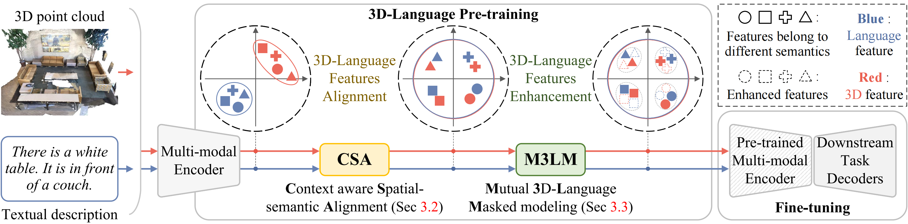
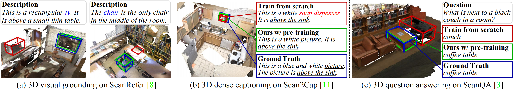
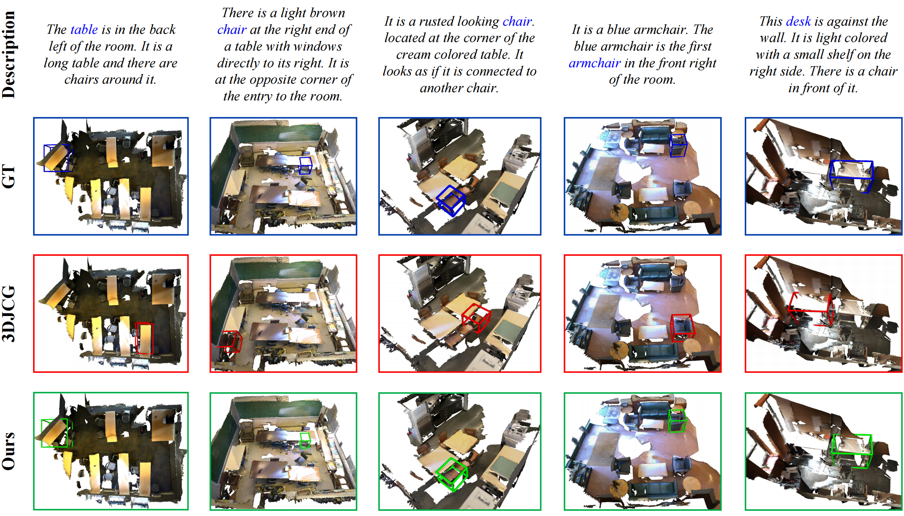
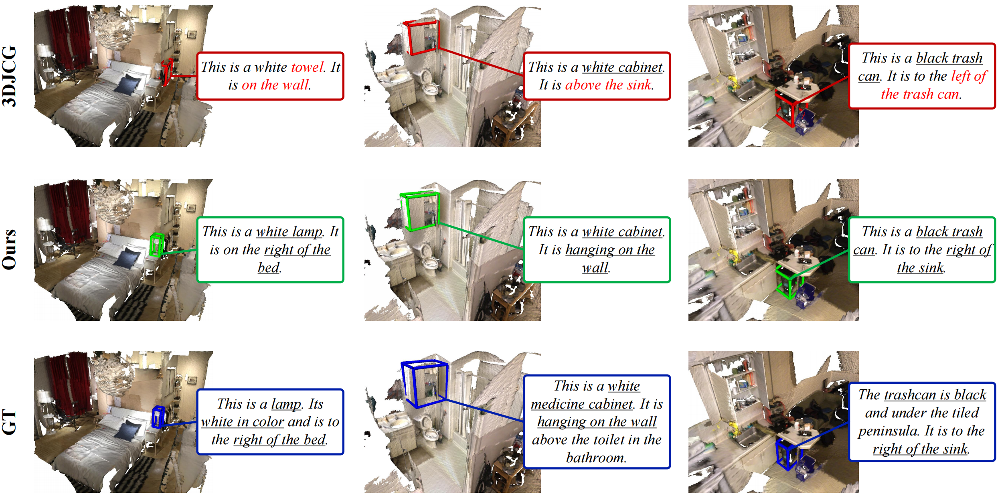
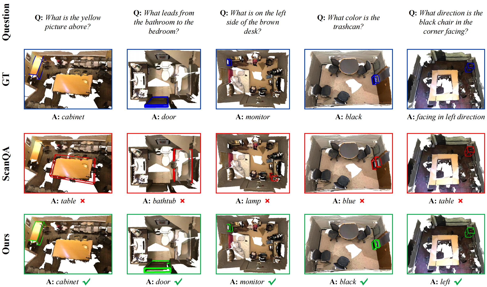

# Context-aware Alignment and Mutual Masking for 3D-Language Pre-training
This repository is for the paper "[Context-aware Alignment and Mutual Masking for 3D-Language Pre-training](https://openaccess.thecvf.com/content/CVPR2023/papers/Jin_Context-Aware_Alignment_and_Mutual_Masking_for_3D-Language_Pre-Training_CVPR_2023_paper.pdf)"  (**CVPR 2023**)

<p align='center'>
  
</p>

## Abstract
3D visual language reasoning plays an important role in effective human-computer interaction. The current approaches for 3D visual reasoning are task-specific, and lack pre-training methods to learn generic representations that can transfer across various tasks. Despite the encouraging progress in vision-language pre-training for image-text data, 3D-language pre-training is still an open issue due to limited 3D-language paired data, highly sparse and irregular structure of point clouds and ambiguities in spatial relations of 3D objects with viewpoint changes. In this paper, we present a generic 3D-language pre-training approach, that tackles multiple facets of 3D-language reasoning by learning universal representations. Our learning objective constitutes two main parts. 1) Context aware spatial-semantic alignment to establish fine-grained correspondence between point clouds and texts. It reduces relational ambiguities by aligning 3D spatial relationships with textual semantic context. 2) Mutual 3D-Language Masked modeling to enable cross-modality information exchange. Instead of reconstructing sparse 3D points for which language can hardly provide cues, we propose masked proposal reasoning to learn semantic class and mask-invariant representations. Our proposed 3D-language pre-training method achieves promising results once adapted to various downstream tasks, including 3D visual grounding, 3D dense captioning and 3D question answering.

## Dataset & Setup

### Data preparation

*Our codes are built based on [ScanRefer](https://github.com/daveredrum/ScanRefer), [3DJCG](https://github.com/zlccccc/3DVL_Codebase) and [ScanQA](https://github.com/ATR-DBI/ScanQA) codebase. Please refer to them for more detailed data preprocessing instructions.*

1. Download the ScanRefer dataset and unzip it under `data/`. 
2. Download the [ScanQA dataset](https://drive.google.com/drive/folders/1-21A3TBE0QuofEwDg5oDz2z0HEdbVgL2?usp=sharing) under `data/qa/`. 
3. Download the preprocessed [GLoVE embeddings (~990MB)](http://kaldir.vc.in.tum.de/glove.p) and put them under `data/`.
4. Download the ScanNetV2 dataset and put (or link) `scans/` under (or to) `data/scannet/scans/` (Please follow the [ScanNet Instructions](data/scannet/README.md) for downloading the ScanNet dataset).

> After this step, there should be folders containing the ScanNet scene data under the `data/scannet/scans/` with names like `scene0000_00`

5. Pre-process ScanNet data. A folder named `scannet_data/` will be generated under `data/scannet/` after running the following command. Roughly 3.8GB free space is needed for this step:

```shell
cd data/scannet/
python batch_load_scannet_data.py
```

> After this step, you can check if the processed scene data is valid by running:
>
> ```shell
> python visualize.py --scene_id scene0000_00
> ```

6. (Optional) Pre-process the **multiview features** from ENet.

- Download:
    Download the ENet [multiview features (~36GB, hdf5 database)](http://kaldir.vc.in.tum.de/enet_feats.hdf5) and put it under `data/scannet/scannet_data/`

- Projection:

   a. Download [the ENet pretrained weights (1.4MB)](http://kaldir.vc.in.tum.de/ScanRefer/scannetv2_enet.pth) and put it under `data/`
   b. Download and decompress [the extracted ScanNet frames (~13GB)](http://kaldir.vc.in.tum.de/3dsis/scannet_train_images.zip).
   c. Change the data paths in `lib/config.py` marked with __TODO__ accordingly.
   d. Project ENet features from ScanNet frames to point clouds (~36GB, hdf5 database).


> ```shell
> python script/multiview_compute/compute_multiview_features.py
> python script/multiview_compute/project_multiview_features.py --maxpool --gpu 1
> ```

### Setup
The codes are tested on Ubuntu 20.04.1 LTS with PyTorch 1.8.0 and CUDA 11.1 installed.

Create and activate a conda environment, for example:
```shell
conda create -n 3D-VLP python=3.6
conda activate 3D-VLP
```

Install pytorch:
```shell
conda install pytorch==1.8.0 torchvision==0.9.0 torchaudio==0.8.0 cudatoolkit=11.1 -c pytorch -c conda-forge
```

Install the required packages listed in `requirements.txt`:
```shell
pip install -r requirements.txt
```

Run the following commands to compile the CUDA modules for the PointNet++ backbone:
```shell
cd lib/pointnet2
python setup.py install
```

## Usage

### Pre-training
To pre-train the model, run the following command:
```shell
sh scripts/pretrain.sh
```
The pre-trained models will be saved under `outputs/exp_pretrain/`.

### Fine-tuning
Fine-tune the model on ScanRefer dataset for 3D visual grounding and dense captioning:
```shell
sh scripts/finetune_scanrefer.sh
```

Fine-tune the model on ScanQA for 3D question answering:
```shell
sh scripts/finetune_scanqa.sh
```

### Evaluate
Before evaluation, please specify the <folder_name> (outputs/ with the timestamp + <tag_name>) of the fine-tuned model and then run the following commands.
For 3D visual grounding:
```shell
sh scripts/eval_ground.sh
```

For 3D dense captioning:
```shell
sh scripts/eval_cap.sh
```

For 3D question answering:
```shell
sh scripts/eval_qa.sh
```

## Results
<p align='center'>
  
</p>

### 3D visual grounding
<p align='center'>
  
</p>

### 3D dense captioning
<p align='center'>
  
</p>

### 3D question answering
<p align='center'>
  
</p>

The visualization results of point clouds are obtained through [MeshLab](https://www.meshlab.net/).

## Citation
```
@inproceedings{jin2023context,
  title={Context-aware Alignment and Mutual Masking for 3D-Language Pre-training},
  author={Jin, Zhao and Hayat, Munawar and Yang, Yuwei and Guo, Yulan and Lei, Yinjie},
  booktitle={Proceedings of the IEEE/CVF Conference on Computer Vision and Pattern Recognition},
  pages={10984--10994},
  year={2023}
}
```

## Acknowledgement
We would like to thank [facebookresearch/votenet](https://github.com/facebookresearch/votenet) for the 3D object detection and [daveredrum/ScanRefer](https://github.com/daveredrum/ScanRefer) for the 3D localization codebase.


## License
This repository is released under MIT License.
